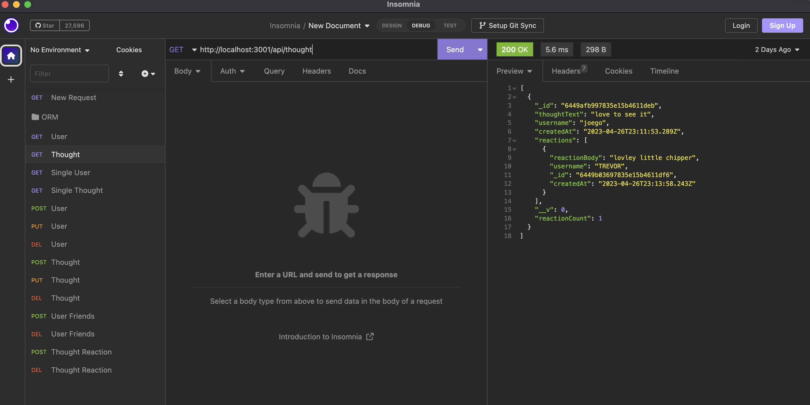

# noSQL-socialNetwork
### Author

[Riley Altenburg](RileyAltenburg@gmail.com)

If you'd like to connect me, please email me!

### Description

My Motivation for the project was to understand MongoDB while utulizing Express.js and Mongoose packages, learning all the new routes and learning how to connect on a social network level

The project was built to create a responsive local MongoDB server that you can make differnet API calls 

This solved how to create an interactive social network where you post create friend ships and even react to what other users do

What I learn from the project, was using mongoose and express, while understanding how routes work in different applications

### Installation

You must Run `npm i` to install all package dependencies, 

Run `mongod` to connect to the server. 
Once everthing is fully downloaded you will run `node server.js` to start your local server, you will follow the link to Insomnia to follow all the paths

### Usage

The program runs as follows:

### Licensing

MIT
